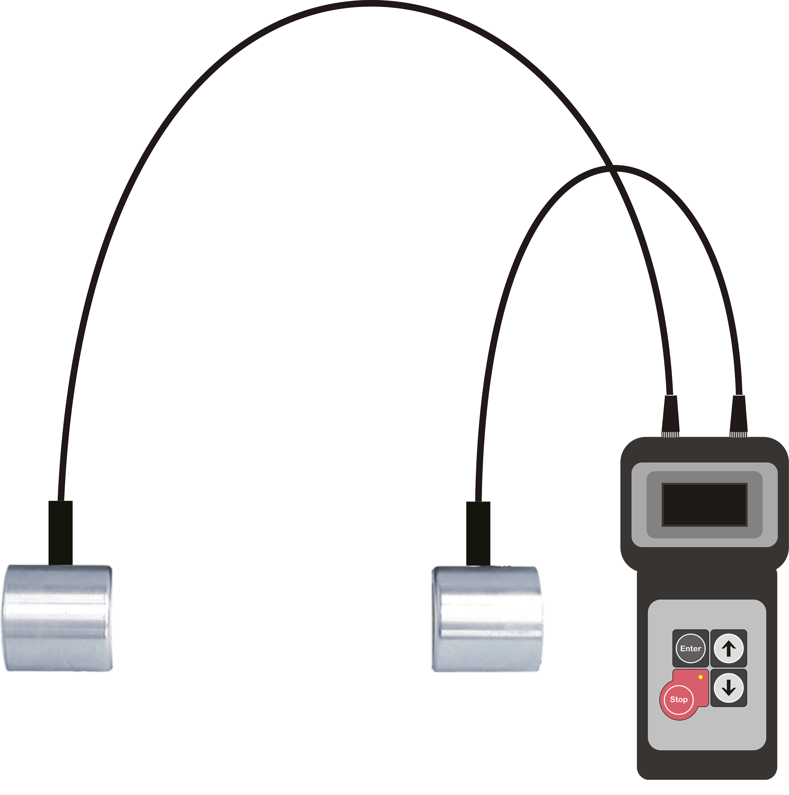
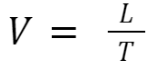
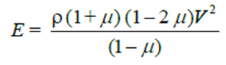
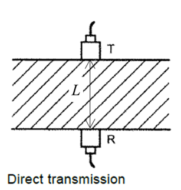
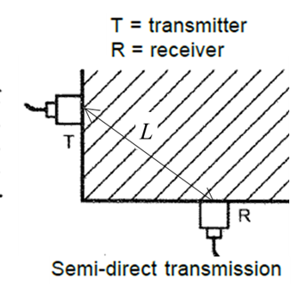
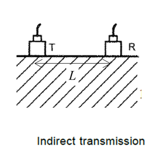

<strong>Introduction</strong>

In an actual structure at site, it is not possible to estimate the strength directly. Some estimates of the quality of concrete as well as of the uniformity of casting of a structure can, however, be obtained by non-destructive techniques such as Ultra-Sonic Pulse velocity (UPV) test and Rebound Hammer tests.

The ultrasonic pulse velocity method could be used to establish:

<ul>1. The homogeneity of the concrete</ul>
<ul>2. The presence of cracks, voids and other imperfections</ul>
<ul>3. Changes in the structure of the concrete which may occur with time</ul>
<ul>4. The quality of the concrete in relation to standard requirements</ul>
<ul>5. The quality of one element of concrete in relation to another</ul>
<ul>6. The values of dynamic elastic modulus of the concrete</ul>

The apparatus for ultrasonic pulse velocity measurement shall consist of a pair of transducers (transmitter and receiver), and an electrical pulse generator and timing device, as shown in the figure below.
 

 
The ultrasonic pulse is generated by an electro acoustic transducer. When the pulse is induced into the concrete from a transducer, it undergoes multiple reflections at the boundaries of the different material phases within the concrete. A complex system of stress waves is developed which includes longitudinal (compressional), shear(transverse) and surface(Raleigh) waves. The receiving transducer detects the onset of the longitudinal waves, which is the fastest. Because the velocity of the pulses is almost independent of the geometry of the material through which they pass and depends only on its elastic properties, pulse velocity method is a convenient technique for investigating in-situ concrete. The underlying principle of assessing the quality of concrete is that comparatively higher velocities are obtained when the quality of concrete in terms of density, homogeneity and uniformity is good. In case of poorer quality, lower velocities are obtained. If there is a crack, void or flaw inside the concrete which comes in the way of transmission of the pulses, the pulse strength is attenuated and it passes around the discontinuity, thereby making the path length longer. Consequently, lower velocities are obtained. The velocity, V, of the pulse for an elastic, homogeneous material is given by:

 

 

where L is the path length in the concrete, and T is the transit time of the pulse.

The elastic constants E and µ are affected by the nature, continuity of solid phase, porosity and presence of micro cracks. The same parameters affect the strength of concrete. So, the pulse velocity can also give an estimate of modulus of elasticity of concrete. The dynamic Young's modulus of elasticity, E, in MPa of the concrete may be determined using the following relationship:
 

 
where V is the pulse velocity in m/s, &#181; is the dynamic Poisson's ratio, and &#961; is the density of concrete in kg/m3.The value of the dynamic Poisson's ratio varies from 0.20 to 0.35, with 0.24 as average. However, it is desirable to have an independent measure of it for the particular type of concrete under test.   

Frequencies as low as 10 kHz and as high as 200 kHz can be used in a UPV test. High-frequency pulses have a well-defined onset but, as they pass through the concrete, they become attenuated more rapidly than pulses of lower frequency. It is therefore preferable to use high-frequency transducers (60 kHz to 200 kHz) for short path lengths (down to 50 mm) and low frequency transducers (10 kHz to 40 kHz) for long path lengths (up to a maximum of 15 m).

UPV testing ideally requires two-sided access to the structural element in question (direct transmission), although testing around corners (semi-direct transmission) and across a surface (indirect transmission) can also be of value. The semi-direct transmissionis typically used in situations where the complex geometry of a structure precludes direct transmission, such as at beam intersections. The indirect transmissionis primarily used for surface-opening crack depth measurements. The three modes of UPV testing are presented in the figure below. The figure also shows the corresponding path length.

 

 

There are various factors which influence pulse velocity measurements, such as:   
<ul>a) Materials and mix proportions of concrete </ul>
<ul>b) Density and modulus of elasticity of aggregate</ul>
<ul>c) Surface condition and moisture content of concrete</ul>
<ul>d) Path length, shape, and size of concrete member</ul>
<ul>e) Temperature of concrete</ul>
<ul>f) Stress to which the structure is subjected</ul>
<ul>g) Reinforcing bars</ul>
<ul>h) Contact between the transducer and concrete</ul>
<ul>i) Cracks and voids</ul>

Generally, a coupling agent, such as oil, petroleum jelly, soluble jelly, moldable rubber, or grease,should be applied to the transducers, or the test surface, or both. The function of the coupling agent is to eliminate air between the contact surfaces of the transducers and the concrete.

The quality of concrete in terms of uniformity, incidence or absence of internal flaws, cracks and segregation, etc., indicative of the level of workmanship employed can thus be assessed using the guidelines given in the following table.

<table>
<thead>
  <tr>
    <th colspan="3">Velocity Criteria for Concrete Quality Grading</th>
  </tr>
</thead>
<tbody>
  <tr>
    <td>S No.</td>
    <td>Average Value of Pulse Velocity by Cross Probing km/s</td>
    <td>Concrete Quality Grading</td>
  </tr>
  <tr>
    <td colspan="3">(i) For Concrete (≤ M25)</td>
  </tr>
  <tr>
    <td>(a)</td>
    <td>Below 3.5</td>
    <td>Doubtful*</td>
  </tr>
  <tr>
    <td>(b)</td>
    <td>3.5 – 4.5</td>
    <td>Good</td>
  </tr>
  <tr>
    <td>(c)</td>
    <td>Above 4.5</td>
    <td>Excellent</td>
  </tr>
  <tr>
    <td colspan="3">(ii) For Concrete (&gt; M25)</td>
  </tr>
  <tr>
    <td>(a)</td>
    <td>Below 3.75</td>
    <td>Doubtful*</td>
  </tr>
  <tr>
    <td>(b)</td>
    <td>3.75 – 4.50</td>
    <td>Good</td>
  </tr>
  <tr>
    <td>(c)</td>
    <td>Above 4.50</td>
    <td>Excellent</td>
  </tr>
</tbody>
</table>

The code recommends that for indirect test ,the pulse velocity may be increased by 0.5 if the calculated velocity is greater than three km/s.

<strong>Apparatus:</strong>

<table  style="width: 600px; ">
    <tr style="background-color: #000; color: #FFF;" align="center">
        <td style="width: 170px; padding: 10px">Name
        </td>
        <td>Remark
        </td>
    </tr>
    <tr>
        <td style="padding: 10px">UPV tester
        </td>
        <td style="padding: 10px">With time-measurement resolution of at least 1 &#181;s
        </td>
    </tr>
    <tr>
        <td style="padding: 10px">Reference Bar
        </td>
        <td style="padding: 10px">With marked transit time
        </td>
    </tr>
    <tr>
        <td style="padding: 10px">Abrasive Stone
        </td>
        <td style="padding: 10px">Medium-grain texture silicon carbide or equivalent material
        </td>
    </tr>
    <tr>
        <td style="padding: 10px">Coupling agent
        </td>
        <td style="padding: 10px">Grease, petroleum jelly etc.
        </td>
    </tr>     
</table>

